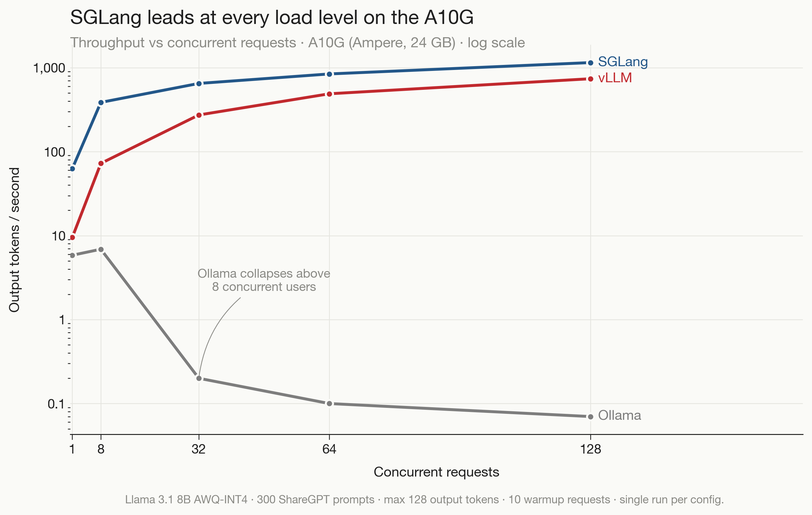
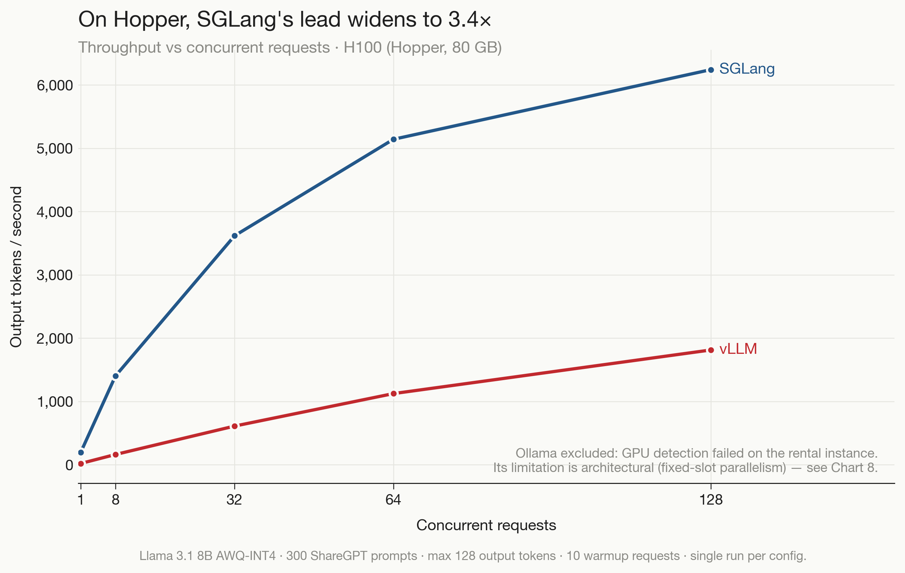
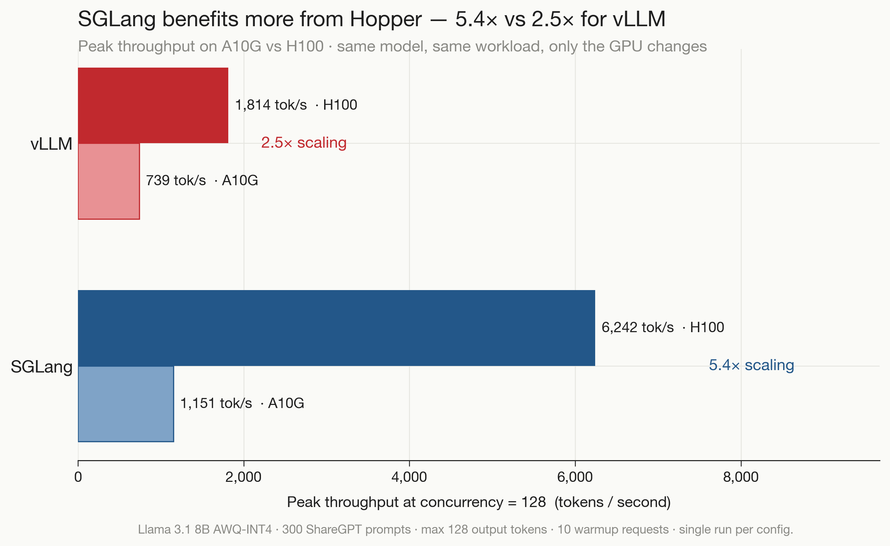
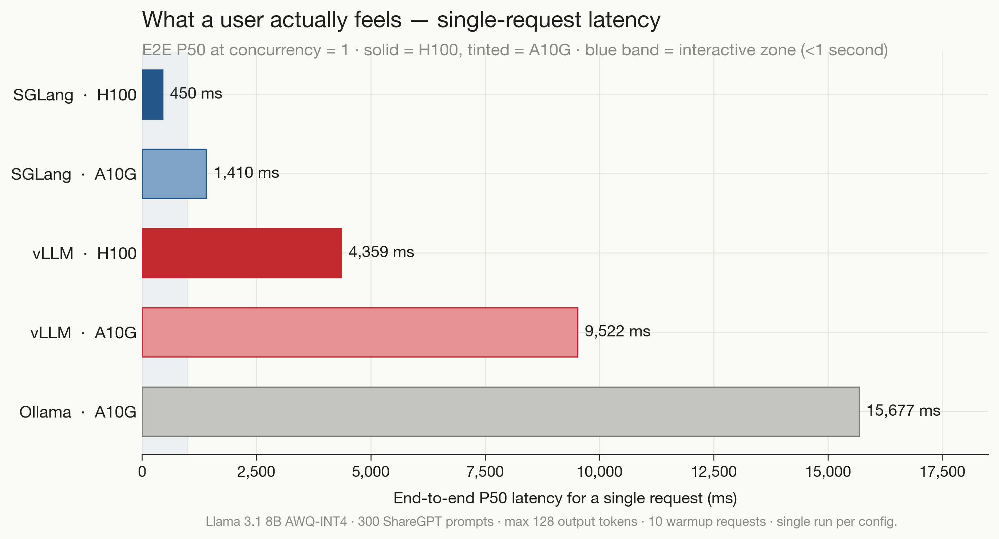
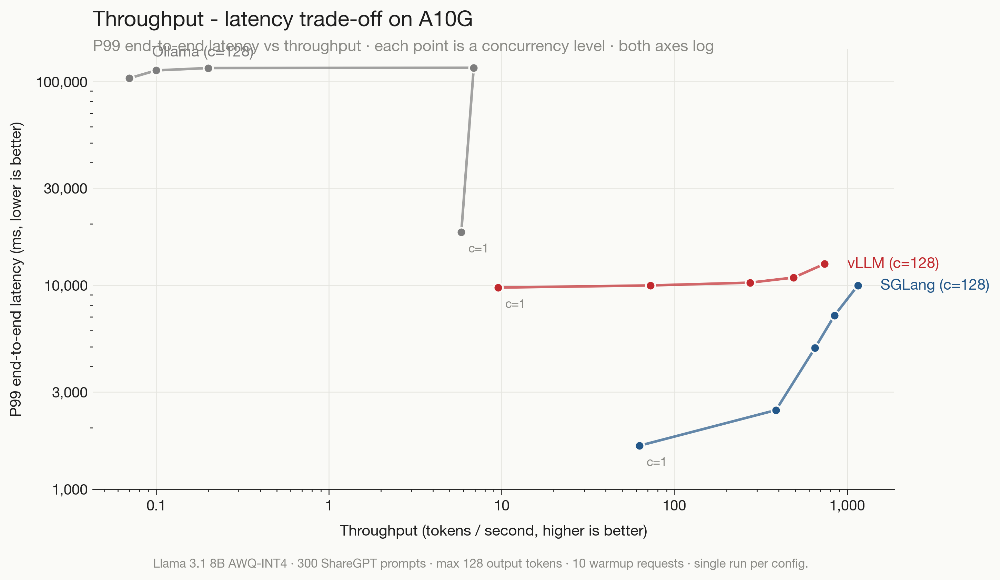
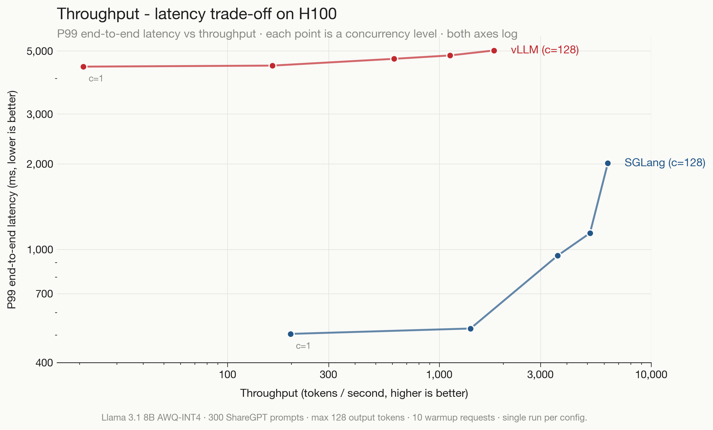
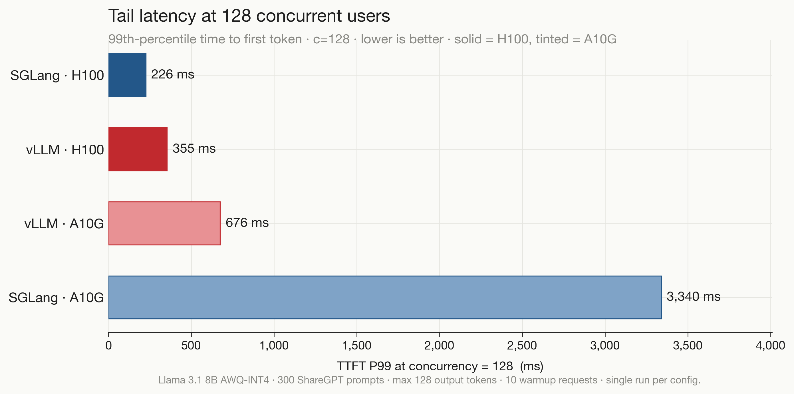
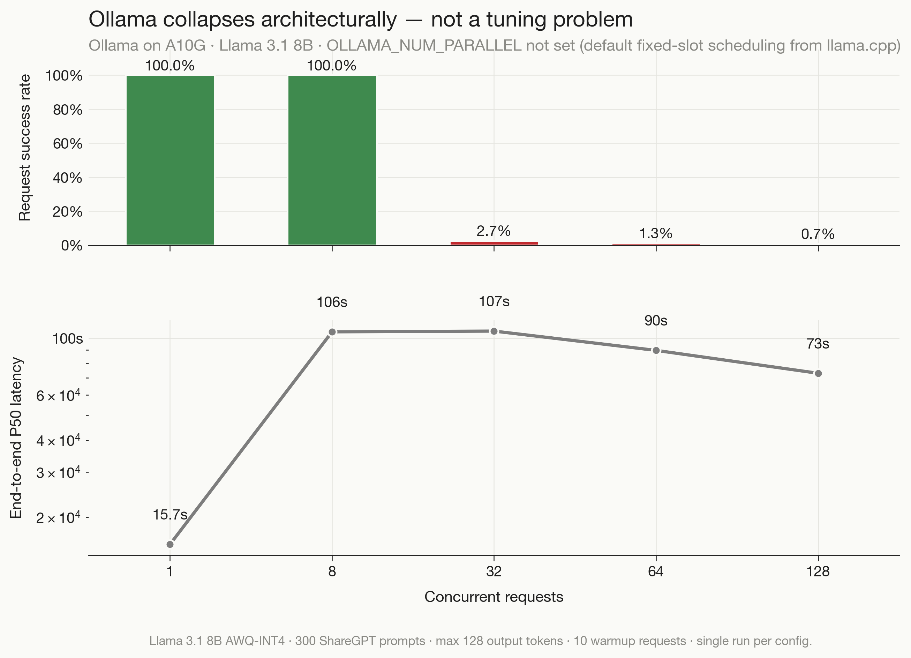

# LLM Inference Benchmark: vLLM vs SGLang vs Ollama

Benchmarking LLM serving frameworks across GPU generations using industry-standard methodology.

Tested on NVIDIA A10G (Ampere, 24 GB) and H100 (Hopper, 80 GB) with Llama 3.1 8B AWQ-INT4, 300 ShareGPT prompts per concurrency level, and P50/P95/P99 percentile reporting.

This work extends [DASH Lab's vLLM vs Ollama benchmark](https://damore-mckim.northeastern.edu) at Northeastern University by adding SGLang and cross-GPU analysis.

---

## Key Findings

**SGLang dominates on both GPU generations.** Its advantage grows on faster hardware.

| GPU | vLLM | SGLang | SGLang advantage |
|-----|------|--------|-----------------|
| A10G (Ampere) | 739 tok/s | 1,151 tok/s | 1.6x |
| H100 (Hopper) | 1,814 tok/s | 6,242 tok/s | 3.4x |

SGLang also delivers sub-second single-request latency (450ms on H100 vs 4,359ms for vLLM), making it better suited for interactive applications.

Ollama collapses above 8 concurrent users — dropping to 0.7% success rate at 128 users. This is architectural (fixed-slot parallelism from llama.cpp), not a configuration issue.

---

## Charts

### Throughput scaling

SGLang leads at every concurrency level on both GPUs. On H100, the gap widens to 3.4x.

<p float="left">
  
  
</p>

### Cross-GPU scaling

SGLang benefits more from the A10G → H100 upgrade (5.4x) than vLLM (2.5x).



### Single-request latency

What a user actually feels. Only SGLang on H100 falls within the interactive zone (under 1 second).



### Throughput-latency tradeoff

Pareto frontier — bottom-right is better (high throughput, low latency). SGLang occupies the optimal region on both GPUs.

<p float="left">
  
  
</p>

### Tail latency at peak load

TTFT P99 at 128 concurrent users. SGLang on H100 keeps tail latency at 226ms.



### Ollama collapse

Success rate drops from 100% to 2.7% at just 32 concurrent requests. Latency jumps to 107 seconds.



---

## Methodology

| Parameter | Value |
|-----------|-------|
| Model | Llama 3.1 8B Instruct AWQ-INT4 |
| Dataset | ShareGPT (real user conversations) |
| Requests per level | 300 |
| Warmup requests | 10 (excluded from measurement) |
| Max output tokens | 128 |
| Concurrency levels | 1, 8, 32, 64, 128 |
| Measurement | Client-side streaming (TTFT, TPOT, ITL, E2E) |
| Percentiles | P50, P95, P99 |

Both GPUs used the same model and configuration. Only the hardware changes.

Based on practices from MLPerf Inference, vLLM bench_serving.py, GuideLLM, and NVIDIA AIPerf.

### Limitations

- Single run per configuration (no confidence intervals)
- No GPU clock locking (5-15% variability possible)
- SGLang auto-converted to awq_marlin kernels on both GPUs
- Closed-loop load generation (semaphore), not open-loop Poisson arrivals

---

## Hardware

| | A10G | H100 SXM |
|--|------|----------|
| Architecture | Ampere (sm_86) | Hopper (sm_90) |
| VRAM | 24 GB GDDR6X | 80 GB HBM3 |
| Memory bandwidth | 600 GB/s | 3,350 GB/s |
| FlashAttention | v2 | v3 |
| Platform | AWS EC2 g5.xlarge | Vast.ai rental |

The A10G shares the same Ampere architecture as DASH Lab's RTX A6000 — results are directly comparable.

---

## Repository Structure

```
llm-bench/
├── benchmark_client.py          # Benchmark engine
├── visualize.py                 # Chart generation
├── results/
│   ├── all_results_a10G.json    # A10G: vLLM, SGLang, Ollama
│   ├── vllm_h100.json           # H100: vLLM
│   └── sglang_h100.json         # H100: SGLang
├── charts/
│   ├── 01_throughput_a10g.png
│   ├── 02_throughput_h100.png
│   ├── 03_pareto_a10g.png
│   ├── 04_pareto_h100.png
│   ├── 05_cross_gpu_scaling.png
│   ├── 06_single_request_latency.png
│   ├── 07_ttft_tail_c128.png
│   ├── 08_ollama_collapse.png
│   └── summary.json
└── README.md
```

---

## Usage

```bash
# Create a config file
cat > config.json << 'EOF'
{
    "gpu": "NVIDIA-A10G-24GB",
    "results_dir": "./results",
    "dataset_path": "./ShareGPT_V3_unfiltered_cleaned_split.json",
    "num_prompts": 300,
    "num_requests": 300,
    "warmup_requests": 10,
    "max_tokens": 128,
    "timeout_sec": 120,
    "concurrency_levels": [1, 8, 32, 64, 128],
    "frameworks": [
        {"name": "vllm", "base_url": "http://localhost:8000", "model": "hugging-quants/Meta-Llama-3.1-8B-Instruct-AWQ-INT4"},
        {"name": "sglang", "base_url": "http://localhost:8001", "model": "hugging-quants/Meta-Llama-3.1-8B-Instruct-AWQ-INT4"},
        {"name": "ollama", "base_url": "http://localhost:11434", "model": "llama3.1:8b"}
    ]
}
EOF

# Start a framework server, then run
PYTHONUNBUFFERED=1 python benchmark_client.py --config config.json
```

---

## Author

**Shivansh Singh**
MS Analytics, Northeastern University

[shivanshsingh.in](https://shivanshsingh.in) | [LinkedIn](https://linkedin.com/in/shivanshsinghh) | [GitHub](https://github.com/meshivanshsinghh)